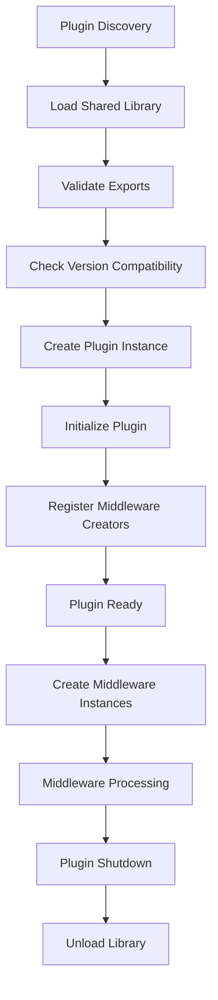

# cppSwitchboard Plugin Development Guide

This guide explains how to create, build, and deploy middleware plugins for the cppSwitchboard framework.

## Table of Contents

1. [Overview](#overview)
2. [Plugin Architecture](#plugin-architecture)
3. [Quick Start Guide](#quick-start-guide)
4. [Plugin Interface](#plugin-interface)
5. [Build System](#build-system)
6. [Configuration](#configuration)
7. [Testing](#testing)
8. [Best Practices](#best-practices)
9. [Troubleshooting](#troubleshooting)
10. [Example: Compression Middleware](#example-compression-middleware)

## Overview

The cppSwitchboard plugin system allows you to create middleware components as dynamically loadable shared libraries (.so/.dll/.dylib files). This enables:

- **Hot-reloading** during development
- **Community contributions** without core framework changes
- **Modular deployments** with only needed middleware
- **Third-party middleware** distribution

## Plugin Architecture

### Core Components

1. **MiddlewarePlugin Interface**: Main plugin interface that frameworks loads
2. **Plugin Metadata**: Version info, dependencies, and descriptions
3. **C Interface**: ABI-stable exports for cross-compiler compatibility
4. **Plugin Manager**: Framework component that loads and manages plugins
5. **Factory Integration**: Automatic registration with middleware factory

### Plugin Lifecycle



## Quick Start Guide

### 1. Create Plugin Structure

```bash
mkdir my_middleware_plugin
cd my_middleware_plugin
touch my_middleware.h my_middleware.cpp CMakeLists.txt
```

### 2. Implement Plugin Interface

**my_middleware.h:**
```cpp
#pragma once
#include <cppSwitchboard/middleware_plugin.h>
#include <cppSwitchboard/middleware.h>

class MyMiddleware : public cppSwitchboard::Middleware {
public:
    cppSwitchboard::HttpResponse handle(
        const cppSwitchboard::HttpRequest& request,
        cppSwitchboard::Context& context,
        cppSwitchboard::NextHandler next) override;
    
    std::string getName() const override { return "MyMiddleware"; }
};

class MyMiddlewarePlugin : public cppSwitchboard::MiddlewarePlugin {
public:
    bool initialize(const PluginVersion& frameworkVersion) override;
    void shutdown() override;
    std::shared_ptr<cppSwitchboard::Middleware> createMiddleware(
        const cppSwitchboard::MiddlewareInstanceConfig& config) override;
    bool validateConfig(const cppSwitchboard::MiddlewareInstanceConfig& config, 
                       std::string& errorMessage) const override;
    std::vector<std::string> getSupportedTypes() const override;
    const MiddlewarePluginInfo& getInfo() const override;

private:
    static MiddlewarePluginInfo pluginInfo_;
};
```

**my_middleware.cpp:**
```cpp
#include "my_middleware.h"

// Plugin metadata
MiddlewarePluginInfo MyMiddlewarePlugin::pluginInfo_ = {
    .version = CPPSWITCH_PLUGIN_VERSION,
    .name = "MyMiddleware",
    .description = "Example middleware plugin",
    .author = "Your Name",
    .plugin_version = {1, 0, 0},
    .min_framework_version = {1, 2, 0},
    .dependencies = nullptr,
    .dependency_count = 0
};

// Implement middleware logic
cppSwitchboard::HttpResponse MyMiddleware::handle(
    const cppSwitchboard::HttpRequest& request,
    cppSwitchboard::Context& context,
    cppSwitchboard::NextHandler next) {
    
    // Your middleware logic here
    // Call next(request, context) to continue pipeline
    return next(request, context);
}

// Implement plugin methods...
bool MyMiddlewarePlugin::initialize(const PluginVersion& frameworkVersion) {
    return frameworkVersion.isCompatible(pluginInfo_.min_framework_version);
}

void MyMiddlewarePlugin::shutdown() {
    // Cleanup if needed
}

std::shared_ptr<cppSwitchboard::Middleware> MyMiddlewarePlugin::createMiddleware(
    const cppSwitchboard::MiddlewareInstanceConfig& config) {
    return std::make_shared<MyMiddleware>();
}

std::vector<std::string> MyMiddlewarePlugin::getSupportedTypes() const {
    return {"my_middleware"};
}

const MiddlewarePluginInfo& MyMiddlewarePlugin::getInfo() const {
    return pluginInfo_;
}

// Required C exports
extern "C" {
    CPPSWITCH_PLUGIN_EXPORT MiddlewarePluginInfo cppSwitchboard_plugin_info = 
        MyMiddlewarePlugin::pluginInfo_;
    
    CPPSWITCH_PLUGIN_EXPORT cppSwitchboard::MiddlewarePlugin* cppSwitchboard_create_plugin() {
        return new MyMiddlewarePlugin();
    }
    
    CPPSWITCH_PLUGIN_EXPORT void cppSwitchboard_destroy_plugin(cppSwitchboard::MiddlewarePlugin* plugin) {
        delete plugin;
    }
}
```

### 3. Create Build Configuration

**CMakeLists.txt:**
```cmake
cmake_minimum_required(VERSION 3.16)
project(MyMiddlewarePlugin VERSION 1.0.0)

set(CMAKE_CXX_STANDARD 17)
set(CMAKE_CXX_STANDARD_REQUIRED ON)

# Set path to cppSwitchboard headers
set(CPPSWITCH_INCLUDE_DIR "/path/to/cppSwitchboard/include")

add_library(my_middleware SHARED
    my_middleware.cpp
    my_middleware.h
)

target_include_directories(my_middleware PRIVATE ${CPPSWITCH_INCLUDE_DIR})

set_target_properties(my_middleware PROPERTIES
    PREFIX ""  # Remove 'lib' prefix
    SOVERSION 1
)

target_compile_options(my_middleware PRIVATE
    -fPIC
    -fvisibility=hidden
)
```

### 4. Build Plugin

```bash
mkdir build && cd build
cmake ..
make
```

### 5. Use Plugin

```cpp
#include <cppSwitchboard/middleware_factory.h>
#include <cppSwitchboard/plugin_manager.h>

// Load plugin
PluginManager& pluginManager = PluginManager::getInstance();
auto result = pluginManager.loadPlugin("./my_middleware.so");

if (result.first == PluginLoadResult::SUCCESS) {
    // Plugin loaded successfully
    MiddlewareFactory& factory = MiddlewareFactory::getInstance();
    
    // Create middleware from configuration
    MiddlewareInstanceConfig config;
    config.name = "my_middleware";
    config.enabled = true;
    
    auto middleware = factory.createMiddleware(config);
    // Use middleware in your pipeline
}
```

## Plugin Interface

### Required Exports

Every plugin must export these C symbols:

1. **`cppSwitchboard_plugin_info`**: Plugin metadata structure
2. **`cppSwitchboard_create_plugin()`**: Factory function to create plugin instance
3. **`cppSwitchboard_destroy_plugin()`**: Cleanup function to destroy plugin instance

### Plugin Metadata

```cpp
struct MiddlewarePluginInfo {
    uint32_t version;                      // Must be CPPSWITCH_PLUGIN_VERSION
    const char* name;                      // Unique plugin name
    const char* description;               // Plugin description
    const char* author;                    // Plugin author
    PluginVersion plugin_version;          // Plugin version (semantic versioning)
    PluginVersion min_framework_version;   // Minimum required framework version
    const PluginDependency* dependencies; // Array of plugin dependencies
    size_t dependency_count;               // Number of dependencies
};
```

### Version Compatibility

Plugins must specify compatible framework versions:

```cpp
PluginVersion framework_version = {1, 2, 0};  // Framework version 1.2.0
PluginVersion min_required = {1, 0, 0};       // Plugin requires >= 1.0.0

bool compatible = framework_version.isCompatible(min_required);
// Compatible if major versions match and minor.patch >= required
```

### Dependencies

Plugins can declare dependencies on other plugins:

```cpp
PluginDependency deps[] = {
    {.name = "AuthPlugin", .min_version = {1, 0, 0}, .optional = false},
    {.name = "LoggingPlugin", .min_version = {2, 1, 0}, .optional = true}
};

MiddlewarePluginInfo info = {
    // ... other fields ...
    .dependencies = deps,
    .dependency_count = 2
};
```

## Build System

### CMake Best Practices

1. **Use shared libraries** (`add_library(name SHARED)`)
2. **Set proper visibility** (`-fvisibility=hidden`)
3. **Remove lib prefix** (`set_target_properties(name PROPERTIES PREFIX "")`)
4. **Enable position-independent code** (`-fPIC`)
5. **Link required libraries** (zlib, openssl, etc.)

### Platform Considerations

**Linux/Unix:**
```cmake
set_target_properties(plugin PROPERTIES SUFFIX ".so")
```

**Windows:**
```cmake
set_target_properties(plugin PROPERTIES SUFFIX ".dll")
```

**macOS:**
```cmake
set_target_properties(plugin PROPERTIES SUFFIX ".dylib")
```

### Installation

```cmake
install(TARGETS my_middleware
    LIBRARY DESTINATION lib/cppSwitchboard/plugins
    RUNTIME DESTINATION lib/cppSwitchboard/plugins
)
```

## Configuration

### Middleware Configuration

Plugins receive configuration through `MiddlewareInstanceConfig`:

```cpp
struct MiddlewareInstanceConfig {
    std::string name;                                     // Middleware type name
    bool enabled = true;                                  // Whether middleware is enabled
    int priority = 0;                                     // Middleware priority
    std::unordered_map<std::string, std::any> config;    // Configuration parameters
};
```

### Configuration Parsing

```cpp
std::shared_ptr<cppSwitchboard::Middleware> MyPlugin::createMiddleware(
    const cppSwitchboard::MiddlewareInstanceConfig& config) {
    
    MyConfig myConfig;
    
    for (const auto& [key, value] : config.config) {
        if (key == "timeout") {
            myConfig.timeout = std::any_cast<int>(value);
        } else if (key == "enabled") {
            myConfig.enabled = std::any_cast<bool>(value);
        } else if (key == "urls") {
            myConfig.urls = std::any_cast<std::vector<std::string>>(value);
        }
    }
    
    return std::make_shared<MyMiddleware>(myConfig);
}
```

### Configuration Validation

```cpp
bool MyPlugin::validateConfig(const MiddlewareInstanceConfig& config, 
                             std::string& errorMessage) const {
    
    try {
        for (const auto& [key, value] : config.config) {
            if (key == "timeout") {
                int timeout = std::any_cast<int>(value);
                if (timeout <= 0) {
                    errorMessage = "timeout must be positive";
                    return false;
                }
            } else if (key == "unknown_key") {
                errorMessage = "unknown configuration key: " + key;
                return false;
            }
        }
    } catch (const std::bad_any_cast& e) {
        errorMessage = "invalid configuration value type";
        return false;
    }
    
    return true;
}
```

### JSON Schema

Provide JSON schema for configuration documentation:

```cpp
std::string MyPlugin::getConfigSchema() const {
    return R"({
        "type": "object",
        "properties": {
            "timeout": {
                "type": "integer",
                "description": "Request timeout in milliseconds",
                "minimum": 1,
                "default": 5000
            },
            "enabled": {
                "type": "boolean",
                "description": "Whether the middleware is enabled",
                "default": true
            }
        },
        "required": ["timeout"]
    })";
}
```

## Testing

### Plugin Load Test

```cpp
#include <cppSwitchboard/plugin_manager.h>

int main() {
    PluginManager& manager = PluginManager::getInstance();
    
    auto result = manager.loadPlugin("./my_middleware.so");
    if (result.first != PluginLoadResult::SUCCESS) {
        std::cerr << "Failed to load plugin: " 
                  << pluginLoadResultToString(result.first) << std::endl;
        return 1;
    }
    
    auto plugin = manager.getPlugin(result.second);
    if (!plugin) {
        std::cerr << "Plugin not found after loading" << std::endl;
        return 1;
    }
    
    std::cout << "Plugin loaded successfully: " << result.second << std::endl;
    return 0;
}
```

### Middleware Function Test

```cpp
#include <cppSwitchboard/http_request.h>
#include <cppSwitchboard/http_response.h>

void testMiddleware() {
    // Create test request
    cppSwitchboard::HttpRequest request;
    request.setPath("/test");
    request.setMethod("GET");
    
    // Create context
    cppSwitchboard::Context context;
    
    // Create middleware
    auto middleware = std::make_shared<MyMiddleware>();
    
    // Create next handler
    auto nextHandler = [](const auto& req, auto& ctx) {
        return cppSwitchboard::HttpResponse(200, "OK", "Test response");
    };
    
    // Test middleware
    auto response = middleware->handle(request, context, nextHandler);
    
    assert(response.getStatusCode() == 200);
    assert(response.getBody() == "Test response");
}
```

### Integration Test

```cpp
#include <cppSwitchboard/middleware_factory.h>

void testIntegration() {
    MiddlewareFactory& factory = MiddlewareFactory::getInstance();
    
    // Load plugin
    factory.loadPlugin("./my_middleware.so");
    
    // Create middleware from config
    MiddlewareInstanceConfig config;
    config.name = "my_middleware";
    config.config["timeout"] = 1000;
    
    auto middleware = factory.createMiddleware(config);
    assert(middleware != nullptr);
    
    // Test middleware in pipeline
    auto pipeline = std::make_shared<MiddlewarePipeline>();
    pipeline->addMiddleware(middleware);
    
    // Test request processing
    HttpRequest request;
    Context context;
    
    auto response = pipeline->process(request, context, 
        [](const auto& req, auto& ctx) {
            return HttpResponse(200, "OK", "Success");
        });
    
    assert(response.getStatusCode() == 200);
}
```

## Best Practices

### 1. Error Handling

- **Always validate configuration** before creating middleware
- **Handle exceptions gracefully** and return appropriate error responses
- **Use reference counting** to prevent plugin unloading while in use
- **Implement health checks** for long-running operations

```cpp
cppSwitchboard::HttpResponse MyMiddleware::handle(
    const cppSwitchboard::HttpRequest& request,
    cppSwitchboard::Context& context,
    cppSwitchboard::NextHandler next) {
    
    try {
        // Your middleware logic
        return next(request, context);
    } catch (const std::exception& e) {
        // Log error and return appropriate response
        return cppSwitchboard::HttpResponse(500, "Internal Server Error", 
                                           "Middleware error: " + std::string(e.what()));
    }
}
```

### 2. Performance

- **Minimize allocations** in the request path
- **Cache expensive operations** (regex compilation, connections)
- **Use move semantics** where appropriate
- **Avoid blocking operations** in the middleware path

```cpp
class MyMiddleware : public cppSwitchboard::Middleware {
private:
    // Cache expensive resources
    mutable std::regex pathPattern_;
    std::shared_ptr<ConnectionPool> connectionPool_;
    
public:
    MyMiddleware(const Config& config) {
        // Pre-compile regex patterns
        pathPattern_ = std::regex(config.pathPattern);
        // Initialize connection pool
        connectionPool_ = std::make_shared<ConnectionPool>(config.poolSize);
    }
};
```

### 3. Thread Safety

- **Make middleware instances thread-safe** (they may be called concurrently)
- **Use atomic operations** for counters and flags
- **Protect shared resources** with appropriate synchronization
- **Avoid global state** when possible

```cpp
class MyMiddleware : public cppSwitchboard::Middleware {
private:
    mutable std::mutex mutex_;
    std::atomic<size_t> requestCount_{0};
    
public:
    cppSwitchboard::HttpResponse handle(...) {
        requestCount_++;  // Thread-safe increment
        
        std::lock_guard<std::mutex> lock(mutex_);  // Protect shared state
        // ... critical section ...
        
        return next(request, context);
    }
};
```

### 4. Configuration

- **Provide sensible defaults** for all configuration options
- **Validate configuration thoroughly** in `validateConfig()`
- **Document configuration** with JSON schema
- **Support both YAML and programmatic configuration**

### 5. Logging and Debugging

- **Use structured logging** with correlation IDs
- **Provide debug information** in context
- **Support different log levels**
- **Include timing information** for performance monitoring

```cpp
cppSwitchboard::HttpResponse MyMiddleware::handle(
    const cppSwitchboard::HttpRequest& request,
    cppSwitchboard::Context& context,
    cppSwitchboard::NextHandler next) {
    
    auto startTime = std::chrono::steady_clock::now();
    
    // Add request ID to context
    cppSwitchboard::ContextHelper(context).setString("request_id", generateRequestId());
    
    auto response = next(request, context);
    
    auto duration = std::chrono::steady_clock::now() - startTime;
    auto durationMs = std::chrono::duration_cast<std::chrono::milliseconds>(duration).count();
    
    // Log processing time
    cppSwitchboard::ContextHelper(context).setString("processing_time_ms", std::to_string(durationMs));
    
    return response;
}
```

## Troubleshooting

### Common Issues

**1. Plugin doesn't load:**
- Check that all required exports are present
- Verify ABI version compatibility
- Ensure all dependencies are available
- Check file permissions and path

**2. Segmentation fault:**
- Verify C++ ABI compatibility between plugin and framework
- Check for memory management issues (use valgrind)
- Ensure proper exception handling

**3. Configuration errors:**
- Implement proper validation in `validateConfig()`
- Check type casting in configuration parsing
- Provide clear error messages

**4. Performance issues:**
- Profile middleware using appropriate tools
- Check for blocking operations in request path
- Monitor memory usage and potential leaks

### Debugging Tips

**1. Enable debug symbols:**
```cmake
set(CMAKE_BUILD_TYPE Debug)
set(CMAKE_CXX_FLAGS_DEBUG "-g -O0")
```

**2. Use plugin manager events:**
```cpp
PluginManager& manager = PluginManager::getInstance();
manager.setEventCallback([](const std::string& event, const std::string& plugin, const std::string& message) {
    std::cout << "[" << event << "] " << plugin << ": " << message << std::endl;
});
```

**3. Test plugin in isolation:**
```cpp
// Test plugin loading without framework
void* handle = dlopen("./my_middleware.so", RTLD_LAZY);
if (!handle) {
    std::cerr << "dlopen failed: " << dlerror() << std::endl;
}
```

## Example: Compression Middleware

See the complete example in `examples/plugins/compression_middleware/` which demonstrates:

- HTTP response compression (gzip/deflate)
- Configuration parsing and validation
- Error handling and fallback behavior
- Performance optimization
- Comprehensive testing

The compression middleware plugin serves as a reference implementation showing all the concepts covered in this guide.

---

For more information, see:
- [Middleware Architecture](MIDDLEWARE.md)
- [Configuration Reference](CONFIGURATION.md)
- [API Documentation](../html/index.html) 